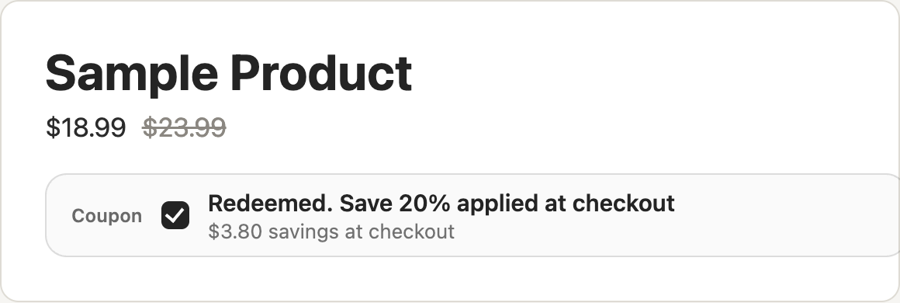
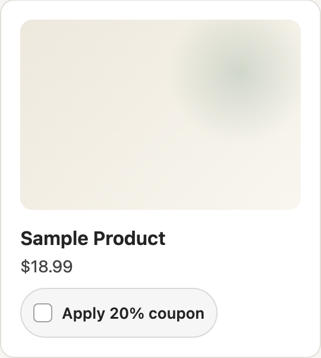

# Selectable Coupon App Block Template

This is a tenant-neutral starter for vibe coding a Shopify coupon app that lets
merchants display clickable, Amazon-style clippable coupons directly on product
pages and collection pages. The storefront widget gives shoppers an immediate
"clip coupon" experience, while the Shopify Discount Function enforces the
coupon at checkout from trusted app-owned configuration.

The template has two source surfaces:

- `tender-app/`: a server-backed Tender app that renders the
  `tender-coupon-widget` custom element and exposes `/api/track` for sanitized
  coupon interaction events.
- `shopify-connector/`: Shopify connector source with a product app block,
  a collection app embed, a Discount Function, and a small App Home starter for
  coupon setup.

## Contract

The storefront widget only writes shopper intent to the cart:

- `_tender_coupon`: stable coupon ID from app-owned config.

The browser never supplies price, eligibility, discount percentage, or checkout
validation. The Discount Function reads trusted app-owned config and applies a
discount only when the marked cart line is eligible.

The runtime marks both classic form submits and common AJAX `/cart/add(.js)`
requests. Themes that post JSON, `FormData`, or URL-encoded bodies should still
receive the same private line property.

## Before Using

Replace every placeholder before deploying:

- Shopify connector ID, client ID, shop domain, and app name.
- Published Tender runtime URLs for `client.js`, `styles.css`, and
  `/api/track`.
- Coupon ID, product IDs, variant IDs, collection IDs, and shopper copy.
- Product app block handle and collection app embed handle if you rename the
  extension blocks.
- The automatic app discount title and Function handle if you rename the
  extension.

Do not commit secrets. Shopify client secrets, Admin API tokens, and app
automation tokens should live in the connector secret store, not this source.

For connector deploys, commit and push connector source to Tender Artifact Git
before running the deploy command so the deployed Shopify app version can be
traced back to durable source.

Use the product app block for PDP placement. Use the collection app embed for
collection pages; after deployment, save the app embed in the theme editor so
the live storefront includes the collection payload and hosted runtime.

## Feature Images

These images show only the relevant coupon UI pattern and intentionally omit
store URLs and unrelated page chrome:

- Product view:
  
- Collection view:
  
